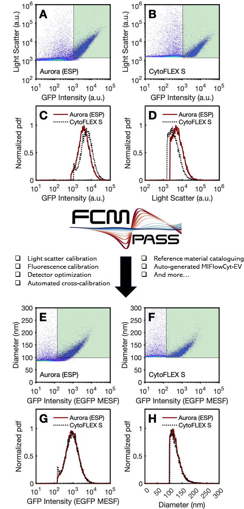

---
hide:
  - navigation
  - toc
---

Unlock the true potential of your small particle data with FCMPASS, a comprehensive small particle flow cytometry cataloguing, optimization, calibration, and reporting software. For more information on what FCMPASS can do for you, see our [documentation](https://app.gitbook.com/o/lKcVPIsFUcqgPTptWWqr/s/-Mfmy5Zr0kloWNc2abdr/).

<figure><figcaption>
Data adapted from: Cook et al., 2023, Cell Reports Methods 3, 100664 December 18, 2023 ª 2023 <a href="https://doi.org/10.1016/j.crmeth.2023.100664">https://doi.org/10.1016/j.crmeth.2023.100664</a>
</figcaption></figure>

