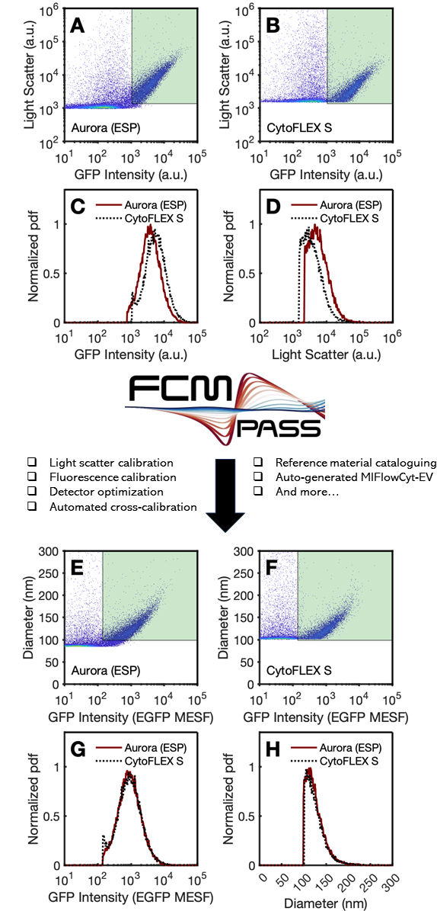

---
hide:
  - navigation
  - toc
---

# Standardize Your Small Particle Flow Cytometry

FCMPASS is a comprehensive software for **cataloguing**, **optimizing**, **calibrating**, and **reporting** small particle flow cytometry data — improving rigor and reproducibility across instruments and laboratories.

[Download :material-download:](download.md){ .md-button .md-button--primary }
[Get a Quote :material-file-document-edit:](https://quote.fcmpass.com){ .md-button target="_blank" }

<figcaption>Data adapted from: Cook et al., 2023, Cell Reports Methods 3, 100664. <a href="https://doi.org/10.1016/j.crmeth.2023.100664">DOI: 10.1016/j.crmeth.2023.100664</a></figcaption>

---

## What FCMPASS Does

-   :material-database:{ .lg .middle } **Catalogue**

    ---

    Store and manage your flow cytometers, light scatter reference materials, fluorescent beads, and rainbow particles in a centralized catalogue — reducing repetitive data entry and ensuring consistency.

    [:octicons-arrow-right-24: Learn more](cataloguing/README.md)

-   :material-chart-bell-curve-cumulative:{ .lg .middle } **Calibrate**

    ---

    Calibrate fluorescence and light scatter data into standardized units, enabling cross-platform comparisons and traceable MIFlowCyt and MIFlowCyt-EV reports.

    [:octicons-arrow-right-24: Learn more](calibration/README.md)

-   :material-tune-vertical:{ .lg .middle } **Optimize**

    ---

    Generate and analyze detector optimization data for both fluorescence and light scatter channels to get the best performance from your flow cytometer.

    [:octicons-arrow-right-24: Learn more](optimization/fluorescence/data-generation.md)

-   :material-file-chart:{ .lg .middle } **Report**

    ---

    Automatically generate transparent, shareable reports with detailed metadata — ready for publication and compliant with MIFlowCyt-EV guidelines.

    [:octicons-arrow-right-24: Learn more](calibration/process-fcs-files.md)

---

## Used by Researchers Worldwide

FCMPASS has been used by **600+ researchers across 29 countries** and demonstrated in peer-reviewed publications by the software's author in journals including *Cytometry Part A*, *Cell Reports Methods*, *Nano Letters*, and *Journal of Extracellular Vesicles*.

[:octicons-arrow-right-24: View publications](examples/README.md)

---

## Supported Cytometer Platforms

FCMPASS works with instruments from leading manufacturers:

**Agilent** · **Beckman Coulter** · **Waters (formerly Becton Dickinson)** · **Cytek Biosciences** · **nanofcm** · **Sony Biosciences** · **ThermoFisher Scientific**

[:octicons-arrow-right-24: Full cytometer list](getting-started/cytometer-support.md)

---

## Get Started

-   :material-download:{ .lg .middle } **Download**

    ---

    Available for Windows and macOS (Apple Silicon). Free for qualifying academic institutions.

    [:octicons-arrow-right-24: Download](download.md)

-   :material-currency-usd:{ .lg .middle } **Pricing**

    ---

    Free academic licenses and paid commercial tiers. Generate a self-service quote instantly.

    [:octicons-arrow-right-24: View pricing](pricing.md)

