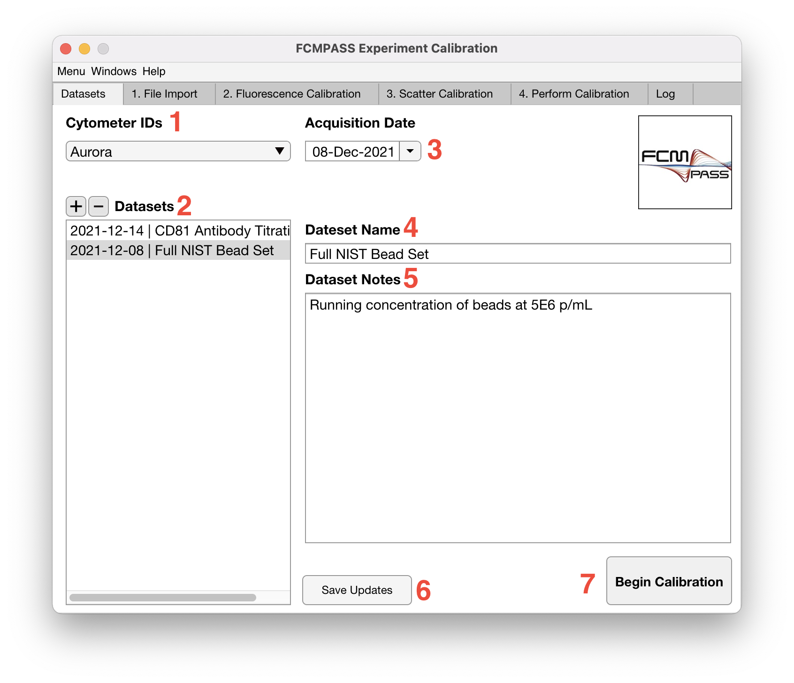
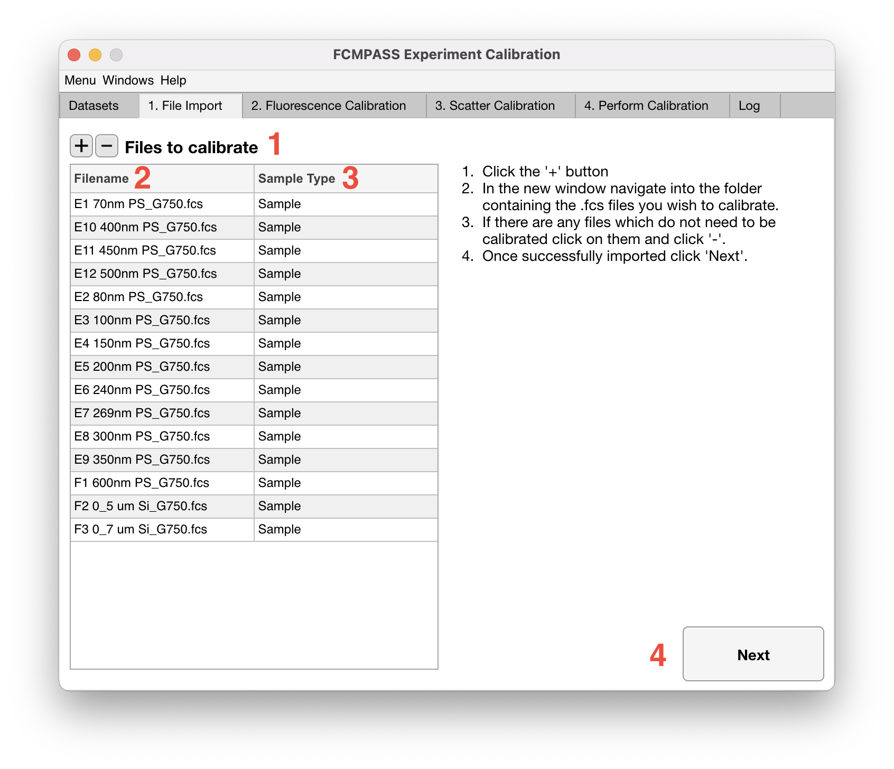

# Calibration

<figure><figcaption></figcaption></figure>

1. To begin calibrating .fcs files, first select a flow cytometer from the Cytometer IDs dropdown, which the .fcs files were obtained. If there are no flow cytometers listed, refer to the [flow cytometer catalogue](../cataloguing/flow-cytometers.md) documentation.

!!! note
    Cross-calibrations are cytometer specific and will only appear in the fluorescent dropdown catalogue for the cytometer they were cross-calibrated on.

2. Once the appropriate cytometer is selected, click the '+' icon and input an experiment name and any associated running notes. Once complete, click 'Begin Calibration'.

<figure><figcaption></figcaption></figure>

3. Click the '+' icon and navigate to the folder contain the .fcs files that you wish to be calibrated. These files will then be checked for compatability with the software and will default to a 'Sample Type' of 'Sample'. Double clicking or right clicking on the sample type will allow you to change to 'FL calibrator' or 'SSC Calibrator'. This will result in the outputted MIFlowCyt-EV report being annotated correctly.
4. Click 'Next' to move to fluorescence calibration.
