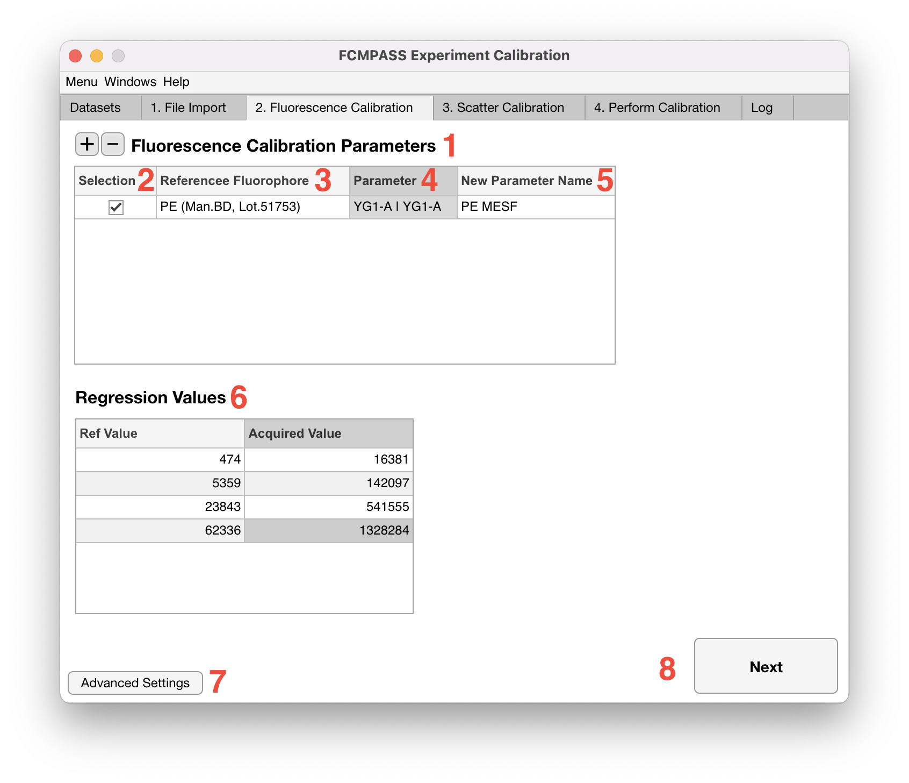
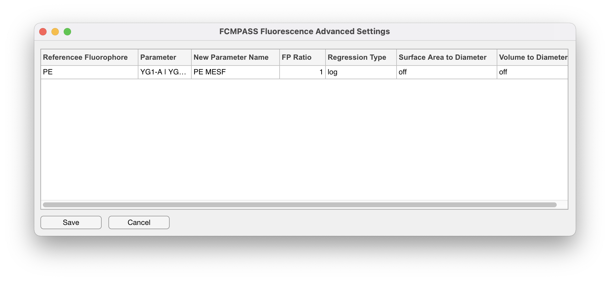

# Fluorescence

<figure><figcaption></figcaption></figure>

1. If a fluorescence parameter is not being calibrated, proceed to [light scatter calibration](light-scatter.md) by clicking 'Next'.
2. If a fluorescence parameter is being calibrated, click the '+' icon.
3. From the 'Reference Fluorophore' dropdown select the catalogued reference standard being used to calibrate the parameter.

!!! note
    Cross-calibrations are cytometer specific and will only appear in the fluorescent dropdown catalogue for the cytometer they were cross-calibrated on.

4. Select the flow cytometer parameter being calibrated e.g., the PE detector

!!! note
    It is recommended that 'Area' parameters are calibrated and not 'Height' due to 'Area' being more accurate for linear extrapolation.

5. How the parameter is named when written to the .fcs file can be modified in the 'New Parameter Name' field. By default this will be named MESF and be preceeded by the calibration fluorophore selected.
6. The obtained reference values for each of the reference populations for the calibrator selected should now be filled in (No. 6).
7. To add additional parameter calibrations return to step 2. Switching between fluorescence calibration inputs can be done by selecting a different parameter under 'Selection' (No.2).

!!! note
    Ref Values of 0 are ignored. Acquired values that are left blank or as 'NaN' will also be ignored.

8. Further calibration criteria can be applied to each fluorescence parameter calibration by clicking the 'Advanced Settings' button (No.7).

<figure><figcaption></figcaption></figure>

9. Here 'FP Ratio' can be modified to better approximate bound detection antibody copies. 'Regression Type' can be modified to linear unit extrapolation, this is not, however, recommended. 'Surface Area to Diameter' can be switched in cases where fluorescence calibrators are in units of nm2. 'Volume to Diameter' can be switched on where fluorescence calibrators are in units of nm3.
10. Once fluorescence parameter calibration critera are complete proceed to light scatter calibration by clicking 'Next'.
