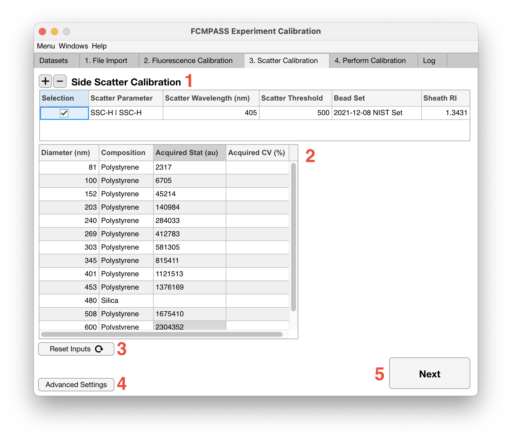
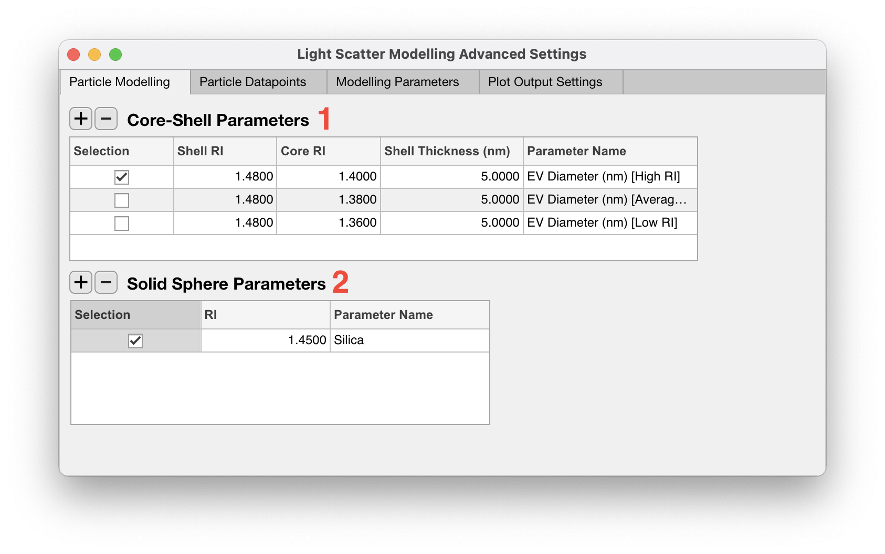
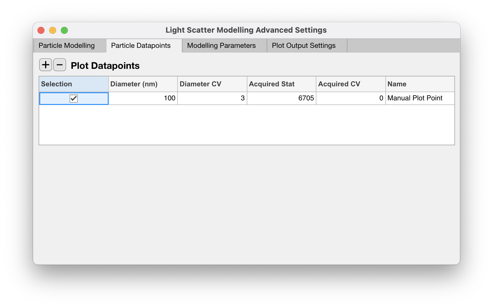
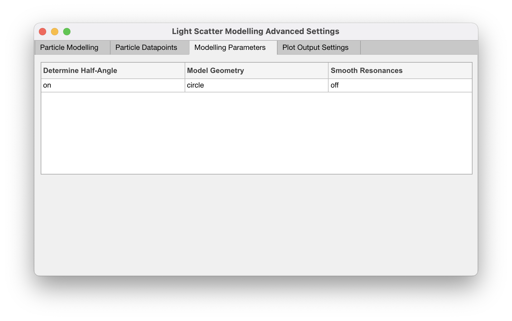
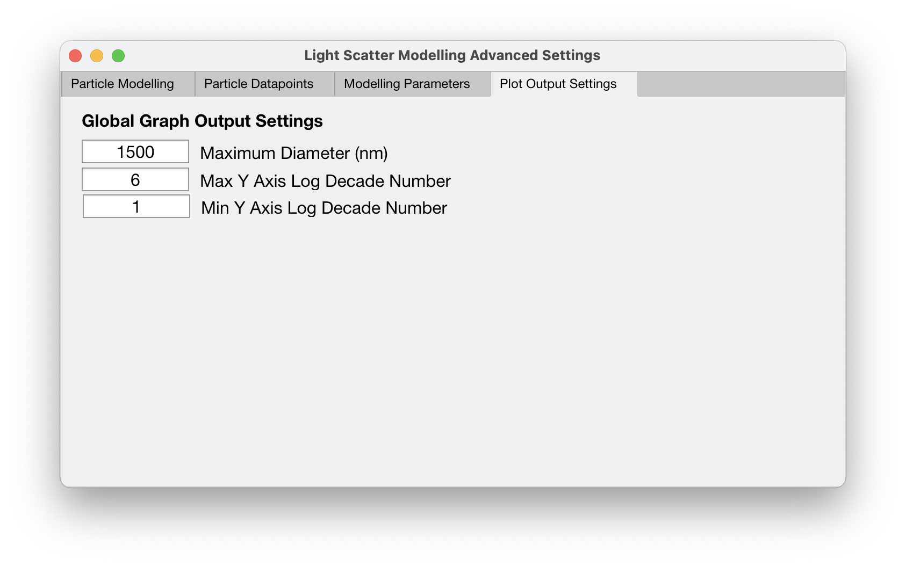

# Light scatter

<figure><figcaption></figcaption></figure>

1. If a light scatter parameter is not being calibrated, proceed to [processing .fcs files](../process-fcs-files.md) by clicking 'Next'.
2. If a light scatter parameter is being calibrated, click the '+' icon. Currently, only side scatter calibration is supported. Flow cytometer light scatter calibrations supported can be found [here](../../cataloguing/README.md)
3. From the 'Scatter Parameter' dropdown select the light scatter parameter that you wish to calibrate.

!!! note
    If this parameter is the same as the trigger threshold of the acquisition the 'Scatter Threshold' field will autocomplete. If more than one trigger parameter is used within the loaded set of .fcs files, FCMPASS will default to the trigger threshold that was used the most.

4. Alter the 'Scatter Wavelength (nm)' field to the wavelength that light scatter calibration is being performed at. Typically this is either 405 or 488 nm.

!!! note
    Updating your the 'Scatter Wavelength (nm)' field will automatically update 'Sheath RIs', calibration bead refractive indices, and custom particle models in the advanced settings. Custom particle models are updated based on the dispersion curves of water.

5. From the 'Bead Set' dropdown, select the calibration beads that were used as calibrators for the acquired data.
6. The median intensity of each bead should then be inputted into the 'Acquired Stat (au)' field. 'Acquired CV (%)' are optional and only used for illustrative purposes on the outputted scatter-diameter plots.

!!! note
    Fields that are left blank or contain 'NaN' will be ignored and removed automatically from downstream calibration.

5. Further advanced light scatter calibration parameters can be applied or modified by clicking the 'Advanced Settings' button (No.4). Otherwise, proceed to [processing .fcs files](../process-fcs-files.md)

## Advanced settings

### Particle models

<figure><figcaption></figcaption></figure>

1. Core-shell models for extracellular vesicles are added as default. The refractive index for their core and shell of the particle can be modified, along with the 'Shell Thickness (nm)'. How the EV models are named within the .fcs file can also be modified by editing the 'Parameter Name' fields.
2. Additional core-shell models can be added by click the '+' icon or removed by selecting the model and click the '-' icon.
3. Solid sphere models are not applied by default, but can be added by clicking the '+' icon under the 'Solid Sphere Parameters' table.

### Custom scatter-diameter datapoints

<figure><figcaption></figcaption></figure>

Sometimes it can be useful to see where a population of know sizes appears within the outputted scatter-diameter curve to have an idea of it's effective refractive index e.g. viruses or beads.

1. Plot datapoints can be specific by clicking the 'Particle Datapoints' tab and adding a datapoint by selecting the '+' icon.
2. The diameter and acquired statistic are required for plotting a datapoint with the CVs being optional.
3. The population name under the legend can be modified by editing the 'Name' field.

### Mie model parameters

<figure><figcaption></figcaption></figure>

1. Modelling parameters relating the collection angle and geometry of the flow cytometer can be customized by selecting the 'Modelling Parameters' tab.
2. An example of performing light scatter calibration with a pre-determined half-angle can be found [here](https://app.gitbook.com/s/EOzMlrsN11b8Qn3Gh0v3/examples/known-angle-scatter-calibration).

!!! note
    Generally, it is not recommended that you alter these settings manually as it can result in inaccurate light scatter calibrations, resulting in inaccurate characterization of your flow cytometer and acquired data.

### Output plot settings

<figure><figcaption></figcaption></figure>

The default x-axis and y-axis limits for scatter QC plots is fixed and may be sub-optimal to illustrate data in some cases. These limits can be modifed by selecting the 'Plot Output Settings' tab.
