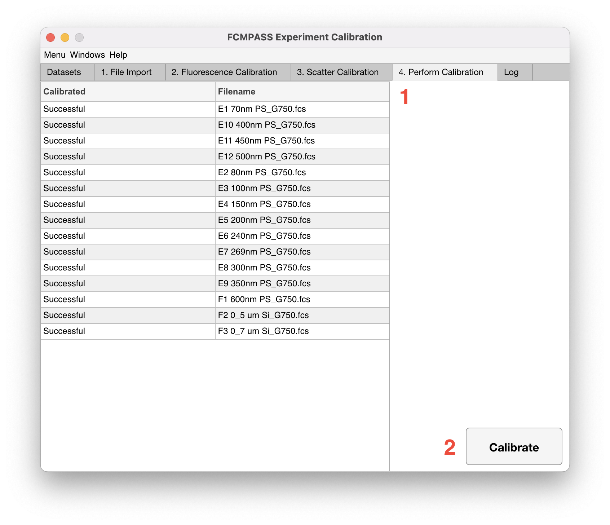

# Process fcs files

<figure><figcaption></figcaption></figure>

Once the calibration parameters have been defined, files can be processed by clicking the 'Calibrate' button (No. 2).

Upon completion of file calibration a summary of the files and whether their calibration was successful or not can be found in the table (No. 1). The calibrated files will be found in the folder containing the original files. FCMPASS exports include:

1. Calibrated .fcs files
2. Fluorescence QC plots (if performed)
3. Light scatter QC plots (if performed)
4. FCMPASSS report
   * FCMPASS summary
   * MIFlowCyt report
   * MIFlowCyt-EV report
   * Sample acquisition information
   * Fluorescence calibration information (if performed)
   * Light scatter calibration information (if performed)
5. Instrument setting information
6. Flow repository .exRNA metadata file
