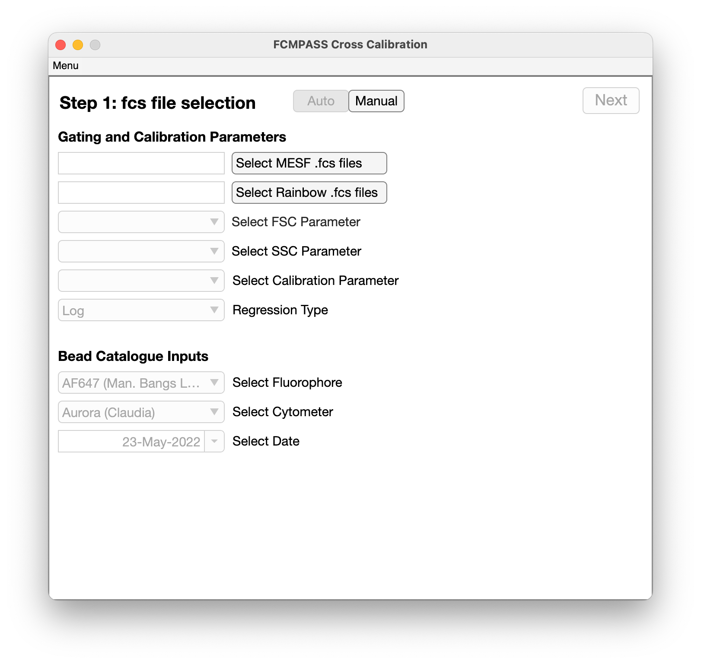
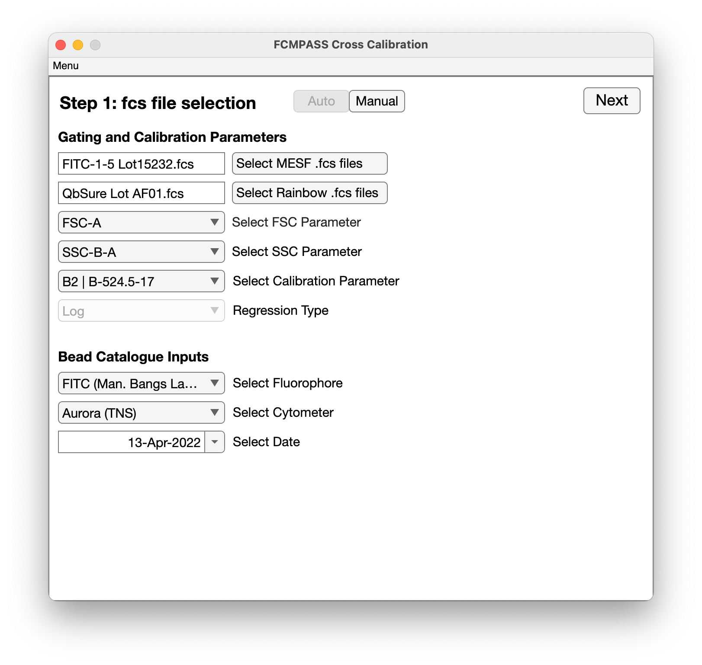
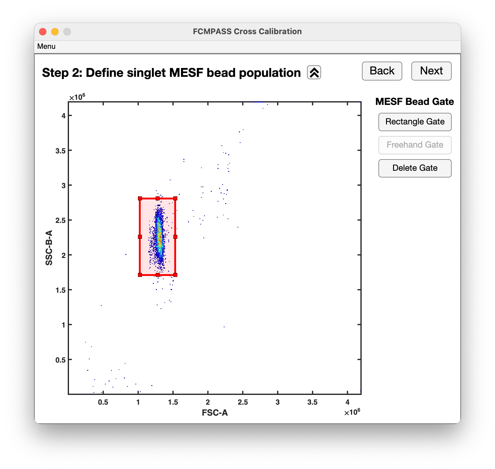
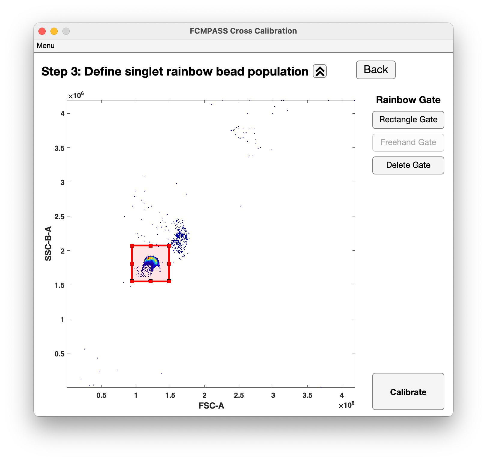
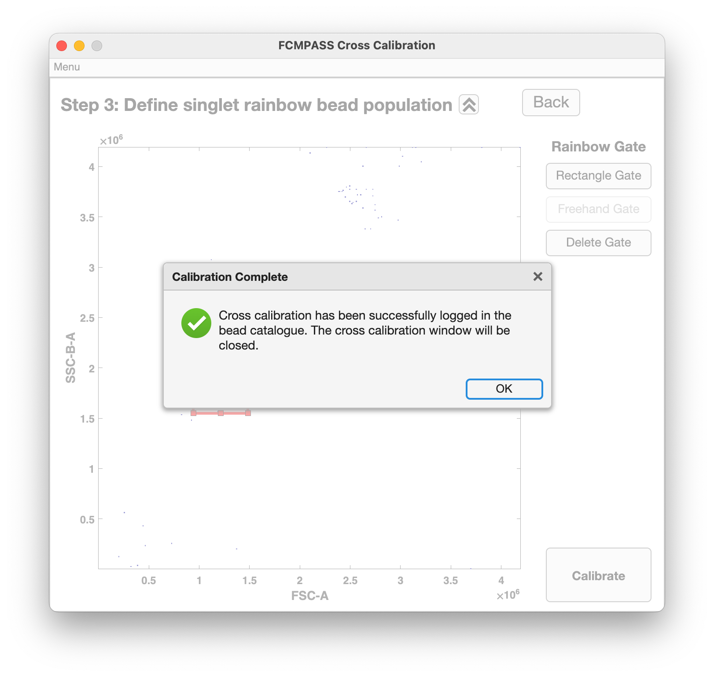
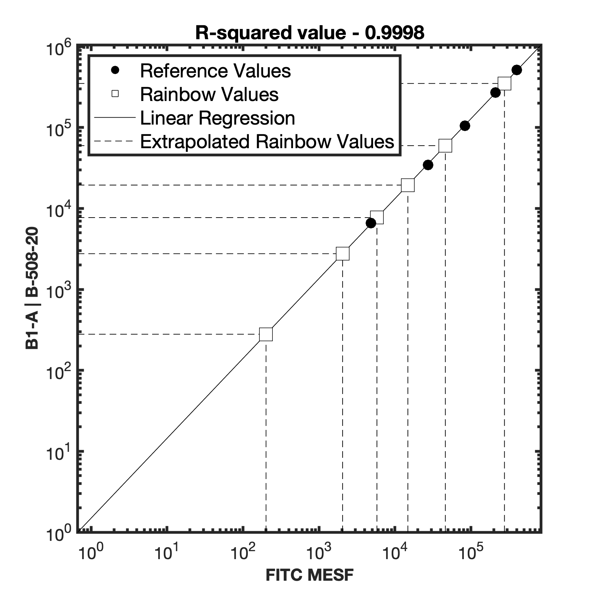

# Automated cross-calibration

Cross-calibrating rainbow beads using MESF beads is an efficient and cost-saving method of calibrating data. FCMPASS supports automated cross-calibration, provided each of the peaks is visibly resolved from one another.

1. Select the rainbow peak bead you wish to cross-calibrate from left hand table.
2. Select 'Add Fluorophore' (No. 5) in the top right corner and a new user-interface will open.

<figure><figcaption></figcaption></figure>

3. Click the 'Select MESF .fcs files' button and navigate to the .fcs containing the MESF bead data you wish to cross-calibrate the rianbow beads with.
4. Click the 'Select Rainbow .fcs files' button and navigate to the .fcs containing the rainbow bead data you wish to cross-calibrate the rianbow beads with.

!!! note
    The parameter you are performing cross-calibration on must be acquired at the same detector settings. Only common detector settings between the two .fcs files are listed in the 'Select Calibration Parameter' dropdown.

<figure><figcaption></figcaption></figure>

5. Select the FSC and SSC parameter used to gate the bead populations, along with parameter that you wish to cross-calibrate.
6. Select the catalogued MESF bead from the 'Select Fluorophore' dropdown menu.
7. Select the cytometer that the cross-calibration will be specific for.
8. Once complete, click 'Next' to proceed to confirming auto-gating accuracy.

!!! note
    Cross-calibrations are filter specific. FCMPASS ties cross-calibrations to the catalogued cytometer to reduce erroneous downstream use of cross-calibrated data.

<figure><figcaption></figcaption></figure>

9. If needed, adjust the singlet gating of MESF beads before clicking 'Next'.

<figure><figcaption></figcaption></figure>

10. If needed, adjust the singlet gating of rainbow beads before clicking 'Next'.

<figure><figcaption></figcaption></figure>

11. Upon completion of cross-calibration a success or error message will be shown and QC data will be automatically outputted to the folder containing the .fcs files.

<figure><figcaption></figcaption></figure>

12. The cross-calibration QC data shows the regression accuracy of the MESF bead populations, along with where the MESF regression line intersects with the rainbow bead populations to designate equivalent reference fluorophore units.
