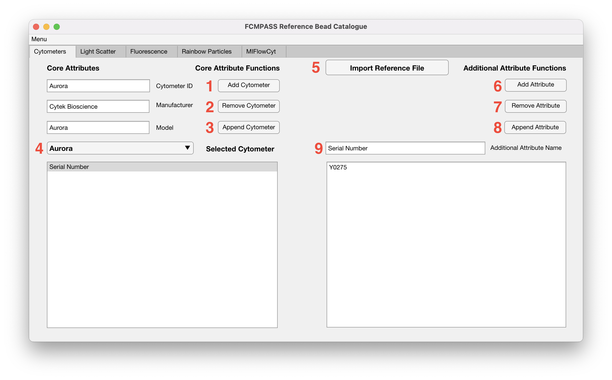

# Flow cytometers

<figure><figcaption></figcaption></figure>

"Core Attribute Functions" on the left-hand side are used for adjusting the cytometer ID, manufacturer, and model. The functions operate on the currently selected cytometer.

1. "**Add Cytometer**" registers a new cytometer with the current inputs for "Cytometer ID", "Manufacturer", and "Model" fields. The new cytometer is added to the "Selected Cytometer" dropdown.
2. "**Remove Cytometer**" deletes the selected cytometer from the database. The selected cytometer is the cytometer that appears in the "Selected Cytometer" dropdown.

   !!! note
       This deletes all information associated with the cytometer, including datasets and cross calibrations.

3. "**Append Cytometer**" overwrites the saved cytometer ID, manufacturer, and model of the currently selected cytometer with the current inputs for "Cytometer ID", "Manufacturer", and "Model" fields.
4. "**Selected Cytometer**" dropdown displays the currently selected cytometer. Any additional attributes associated with the current cytometer are displayed in the text box below the "Selected Cytometer" dropdown.
5. "**Import Reference File**" allows the user to select a representative .fcs file to scrape the instrument information to auto-complete fields.

"Additional Attribute Functions" on the right-hand side are used for saving any additional information about the cytometer. The attributes will be written in the MIFlowCyt report when calibrating an "Experiment Calibration" dataset.

6. "**Add Attribute**" adds the additional attribute to the selected cytometer.
7. "**Remove Attribute**" removes the selected additional attribute (from the large text box on the right-hand side) from the selected cytometer.
8. "**Append Attribute**" overwrites the selected additional attribute (from the large text box on the right-hand side) from the selected cytometer with the current inputs for "Additional Attribute Name" and value from the text box below.
9. "**Additional Attribute Name**" field is where additional attribute name is inputted. The latge text box immeadiately below is where the attribute value is entered.
