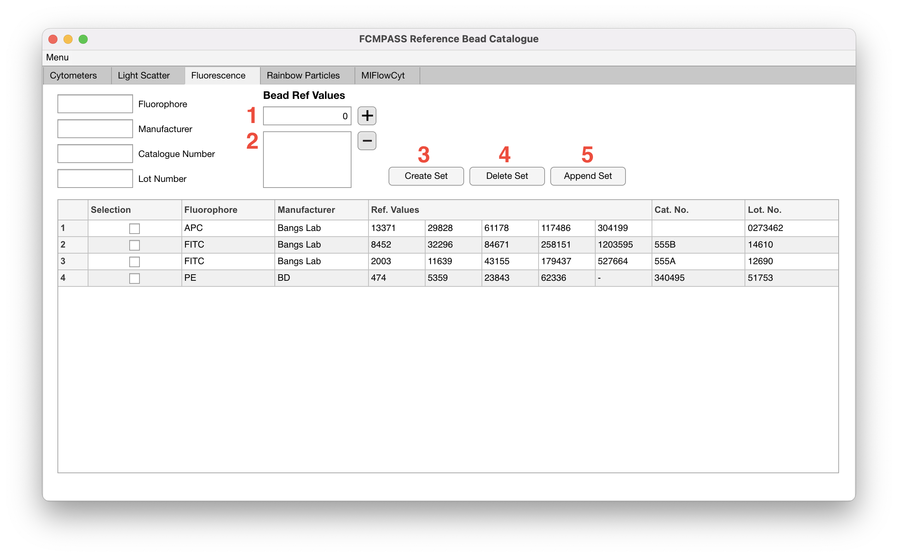

# Fluorescent beads

Fluorescence reference materials 'Fluorophore', 'Manufacturer', 'Catalogue Number', 'Lot Number', and 'Bead Ref Values' for each set.

<figure><figcaption></figcaption></figure>

1. 'Reference Value Edit Field' is where individual reference values for corresponding beads are entered. Pressing the '+' button adds the reference value to the (2) 'Reference Value Listbox'.
2. The values from the 'Reference Value Listbox' are added to the bead when a set is created.
3. 'Create Set' button takes the current edit field inputs and the 'Reference Value Listbox' and creates a bead set that can be accessed in the 'Experiment Calibration' and 'Detector Optimization' modules.
4. 'Delete Set' button take the selected bead sets in the table and deletes them. Note: Any associated cross calibrations will be deleted and unrecoverable.
5. 'Append Set' button takes the selected bead set in the table, and appends the current edit field inputs and 'Reference Value Listbox' values to the selected bead set.
