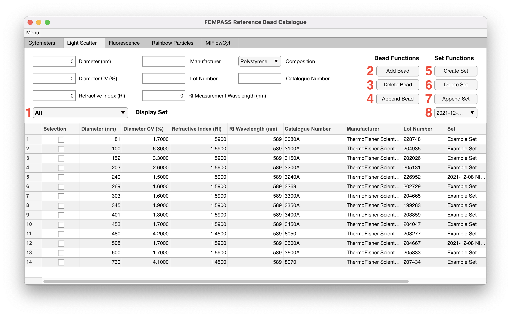

# Scatter beads

Light scatter reference materials tend to be NIST-traceable size standards that are accompanied with certificates. The accompanying certificate typically will list the Diameter, Diameter CV, Refractive Index, and RI Measurement Wavelength.

<figure><figcaption></figcaption></figure>

1. 'Display Set Dropdown' shows the currently selected bead set. The 'All' bead set is reserved by the software and lists all created beads. Additional bead sets can be created with the 'Set Functions'.
2. 'Add Bead' button takes the current edit field inputs and creates a new bead that is added to the 'All' bead set.
3. 'Delete Bead' button takes the currently selected beads in the table and removes them from the currently selected bead set.
4. 'Append Bead' button appends the current edit field inputs to the selected bead from the table.
5. 'Create Set' button takes the currently selected beads in the table and creates a new bead set. The user will be prompted to create a unique name for the new bead set.
6. 'Delete Set' button takes the currently selected bead set in the 'Display Set Dropdown' and deletes the bead set. The beads in the set are not deleted and continues to exist in all other bead sets.
7. 'Append Set' button takes the selected bead set in the 'Append Set Dropdown' and adds the currently selected beads in the table to the selected bead set in the 'Append Set Dropdown'.
8. 'Append Set Dropdown' lists the bead set the user desires to append the selected beads from the table to the selected bead set in the 'Append Set Dropdown.
