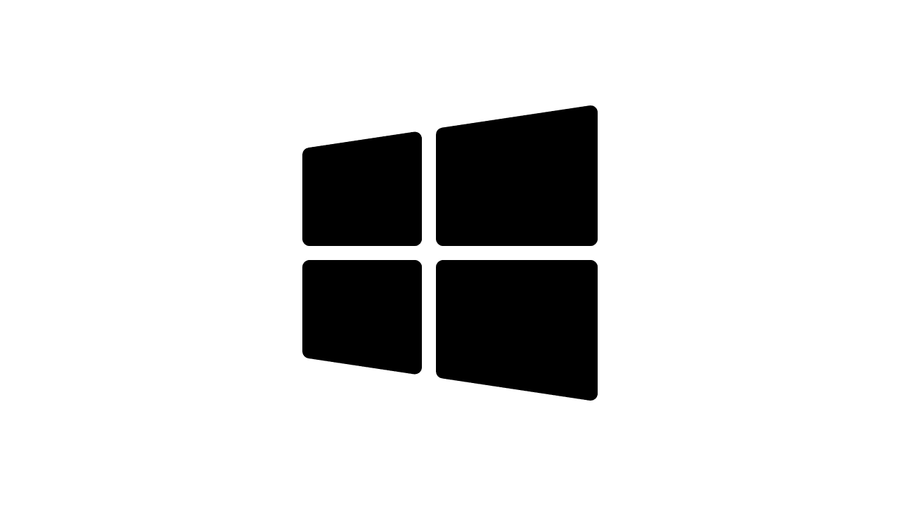

---
hide:
  - navigation
  - toc
---

# Download

For information on installation, registration, and login, please see the [documentation](README.md).&#x20;

## Software access and features

!!! note
    For full details of the end user agreement, please read our [terms of service](legal/terms-of-service.md).

    If your institutional email address is not recognized please contact:[ info@fcmpass.com](mailto:info@fcmpass.com). If you are suspected of using the software outside of the [terms of service](legal/terms-of-service.md), your account may be suspended.

    You can check if your email address is recognized at: [check.fcmpass.com](https://check.fcmpass.com/):

=== "Free tier:"

    The software can be access for free provided the following criteria are followed:

    1. The software is being used within an authorized and accredited degree granting institution
    2. The software will not be utilized for:
        - commercial business, including research and development, marketing and sales literature, commercial white papers.
        - fee-for-service work performed for customers outside the licencee’s institution
        - industrial collaboration(s) whereby software outputs and data, that are not publicly available, are shared with commercial entities

=== "Paid tier:"

    If the software needs to be used in a way that doesn't fall within the specified 'free tier' criteria,  unrestricted licenses can be purchased. Please contact [sales@fcmpass.com](mailto:sales@fcmpass.com).&#x20;

    Paid tiers will also have access to:

    * Beta-releases containing early access features
    * Organizational management of user licenses
    * Premium support services

## Registration

Please refer to the installation and registration [documentation](getting-started/registration-and-login.md) for supported platforms and login information.

  

    <a href="https://win.download.fcmpass.com" target="_blank" style="display: inline-block; width: 100%; text-decoration: none; color: inherit;">
      
      
Download Windows

    </a>
    

    

    <a href="https://mac.download.fcmpass.com" target="_blank" style="display: inline-block; width: 100%; text-decoration: none; color: inherit;">
      
      
Download Mac

    </a>
    

