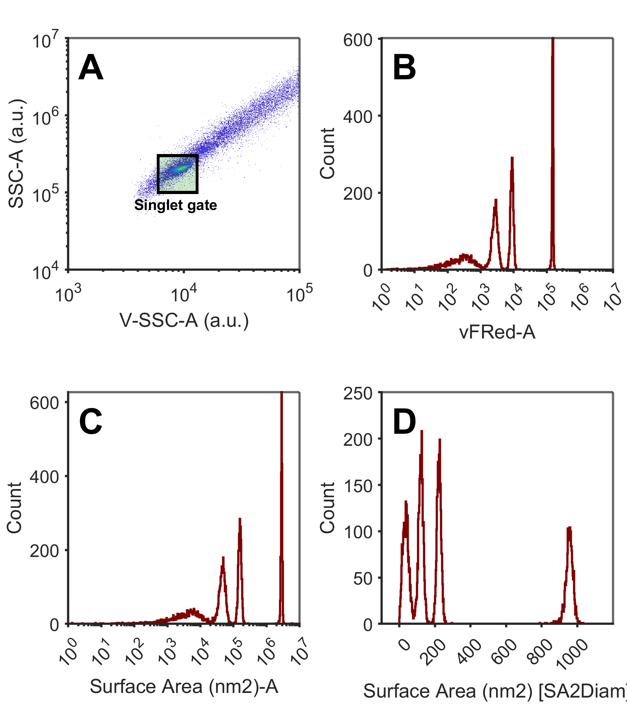
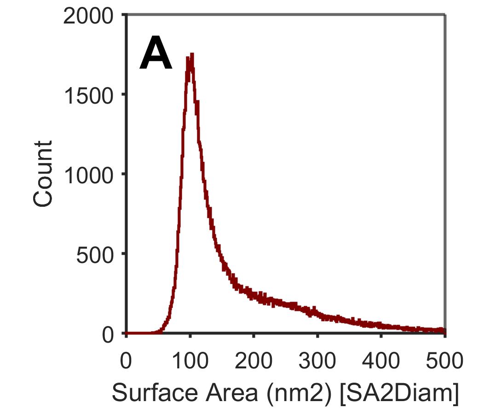

# Fluorescence diameter

FCMPASS supports the conversion of fluorescence surface area regressions and the conversion to diameter by assuming a sphere. Below is an example of commercially available reagents (vFC, Cellarcus) that support this workflow.

## Gating reference beads

The first step in calibrating small particle data is to obtain the statistics of the reference material to perform gating.&#x20;

1. Import reference bead files into a flow cytometry analysis software (or coding software), and gate the singlets (Plot A) using light scatter. For large beads (>1 micron) this can typically be done with a FSC and SSC parameter. For smaller beads to SSC parameters may be needed. If your cytometer only has only light scatter parameter use a histogram to gate.&#x20;
2. Once gated your multi-spectral beads can be checked for separation across various channels (Plot B-F). Typically, it is easiest to gate dim populations from oneanother using height as the data will all be present on a log scale. If area is used, data may be negative and some flow cytometry analysis package will not include events off scale in statistics.&#x20;
3. It can be seen in the plots below that PE-H (Plot E) shows the best separation of all beads. We will therefore gating each of the individual populations using PE-H&#x20;

<figure><figcaption>
Gating singlet population of multi-spectral beads (A) and inspecting the separation of each population across different fluorescence detectors (B-F)
</figcaption></figure>

4. Once each of the PE-H populations has been gated we can obtain the statistics for all necessary fluorescence parameter on the area (-A) statistic. It should be noted that populations with large overlaps are unlikely unresolved and their units should be ignored.&#x20;

<figure><figcaption>
Gating of individual fluorescence population on PE-H (A) and view the gated populations overlaid across different fluorescence detectors (B-F)
</figcaption></figure>

5. Upon obtaining the statistics from each population we can now move to calibrating the data in FCMPASS. In this case we will use only vFRed-A (the membrane dye).

| Parameter | Peak 1 | Peak 2  | Peak 3  | Peak 4 |
| --------- | ------ | ------- | ------- | ------ |
| vFRed-A   | 16     | 2701.90 | 8846.75 | 150763 |

6. Along with the gated median fluorescence intensity statistics in Step 5, having the assigned units that came with the bead lot should also be available.

| Reference | Peak 1 | Peak 2 | Peak 3 | Peak 4  |
| --------- | ------ | ------ | ------ | ------- |
| SA (nm)   | 0      | 44922  | 163832 | 2833170 |

## Adding your reference materials to FCMPASS

FCMPASS catalogues all of your reference materials so that you can easily access the reference numbers for future experiments and create automated reports for increasing the  transparency and ease of sharing your datasets.

1. Open FCMPASS, select 'Catalogue' and navigate to the 'Fluorescence' tab.

!!! note
    Ensure you have added a cytometer as outlined in [Flow cytometers](../cataloguing/flow-cytometers.md "mention").

2. Input the nanoRainbow information and add 'Create Set'.

<figure><figcaption></figcaption></figure>

## Calibrate your data with FCMPASS

Now that your reference materials have been added and you have the median fluorescence intensity for your bead population you're ready to calibrate your data.&#x20;

1. Go to the start menu of FCMPASS and select 'Experiment Calibration'.
2. Select the cytometer you acquired your data on and create a new experiment by click '+'.
3. Name the dataset and click 'save'
4. Now import all of your .fcs files that were acquired at the same settings as your nanoRainbow beads

<figure><figcaption></figcaption></figure>

5. Click 'Next' and add a fluorescence calibration by clicking the '+' button.&#x20;
6. Select the surface area calibration, choose the appropriate parameter (vFRed-A), and rename the parameter parameter appropriately (this is how it will appear in the .fcs file)

<figure><figcaption></figcaption></figure>

7. Now input the relavant median fluorescence intensity statistc that was obtained earlier into the 'Regression Values' box.

!!! note
    FCMPASS automatically checks for linearity of your values. If a box turns red it may be that the number enter was accidently incorrect. If the first box is red and all others are green, it is most likely the first bead was not fully resolved in which case the 'Acquired value' can be left blank.

<figure><figcaption></figcaption></figure>

8. To convert the surface area regression into units of diameter select 'Advanced settings' and turn 'Surface Area to Diameter ' to 'on' and press 'save'.
9. You can now click 'Next through to 'Perform Calibration' and click 'Calibrate'.
10. All files will be exported into an 'FCMPASS Export' folder in the location that the files were originally imported from.&#x20;

## Calibrated data

1. Now when inspecting your .fcs files in analysis software you will see the original parameter for the beads light scatter and fluorescence (Plot A-B) and two new parameters. The surface area calibrated data (Plot C) and the conversion of surface area to diameter data (Plot D).&#x20;

<figure><figcaption>
nanoRainbow beads gated with singles (A), arbitrary unit fluorescence data (B), calibrated surface area units (C) and calibrated diameter units (D). 
</figcaption></figure>

2. This data can now be used to look at your EV samples in calibrated units.&#x20;

<figure><figcaption>
EVs calibrated from surface area fluorescence units to diameter units.
</figcaption></figure>
