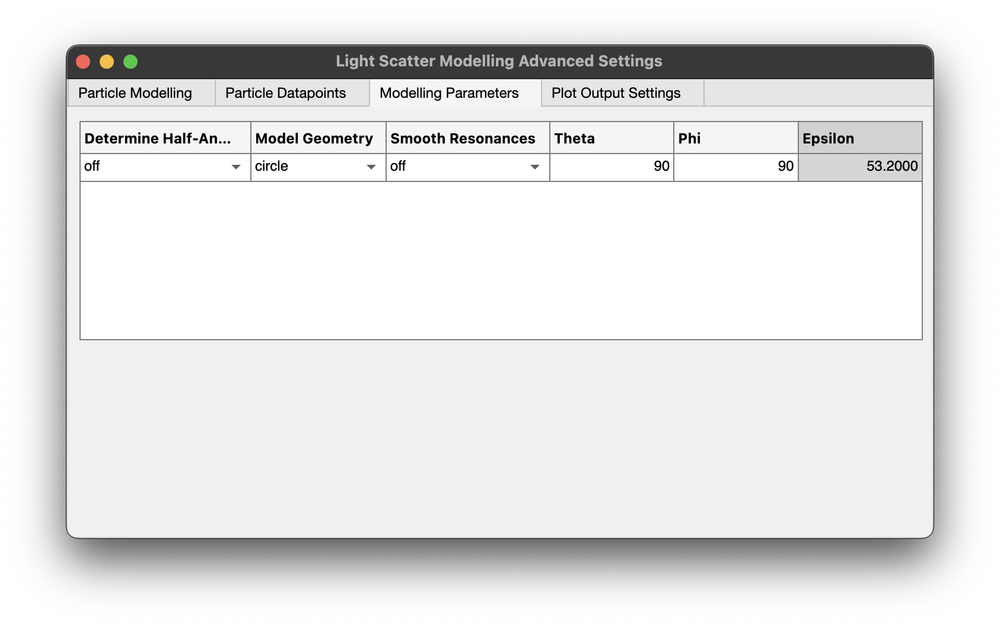

# Known angle scatter calibration

FCMPASS light scatter calibration is built around deriving the collection angle from multiple light scatter reference materials with known diameters and refractive indices. There are instances where running a full set of beads or requiring the derivation of collection angle may not be necessary. The collection angle of most flow cytometers is very stable and deriving the collection angle may only need to be done periodically, such as when an engineer service or realigns and instrument.&#x20;

Upon performing an FCMPASS calibration a report is generated. Under the 'SSC Cali' sheet all the information confirmed with the light scatter calibration can be found.&#x20;

<table><thead><tr><th width="172">SSC Parameter</th><th width="124">Wavelength</th><th width="134">Sheath RI</th><th width="158">Determine HA</th><th width="152">Aperture Geom</th><th width="82">Theta</th><th width="69">Phi</th><th width="96">Epsilon</th><th width="140">Cali. Factor (nm^2)</th></tr></thead><tbody><tr><td>FL5-H | VSSC-H</td><td>405</td><td>1.343091653</td><td>on</td><td>circle</td><td>90</td><td>90</td><td>53.2</td><td>0.003651666</td></tr></tbody></table>

The first table in the 'SSC Cali' report tells us the collection angle of the cytometer with the headers 'Theta', 'Phi', and 'Eps'. Once these are known calibration on the same instrument can be applied with just a single bead by following these steps:

1. Import fcs files
2. Click the 'Scatter Calibration' tab
3. Click the '+' and select the light scatter channel that was previous calibrated.
4. Enter the median scatter intensity for a single bead.

<figure><figcaption>
Light scatter calibration input
</figcaption></figure>

5. Click 'Advanced Settings'  and navigate to 'Modelling Parameters'
6. Change 'Determine Half-Angle' to 'off' and complete the inputs as were in the FCMPASS output report.

<figure><figcaption>
Advanced scatter settings input
</figcaption></figure>

