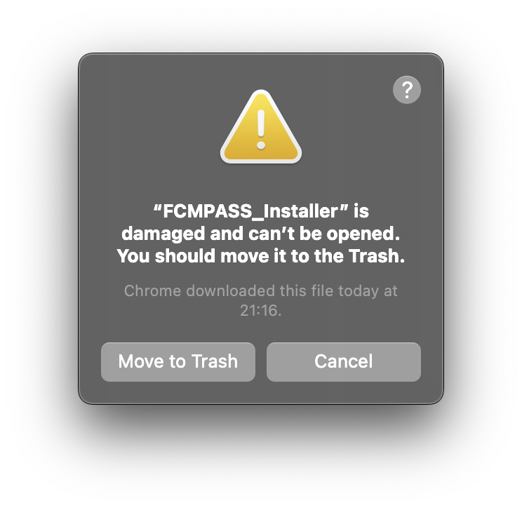

# Installation

## MacOS


FCM<sub>PASS</sub> is currently in the progress of becoming an official Apple developer to digitally sign installation files. In the meantime, when trying to open the FCM<sub>PASS</sub>_Installer you may receive the message below which is due to MacOS blocking the opening of the installation.&#x20;

<p align="center">
    
</p>

To open the FCM<sub>PASS</sub>_Installer follow these steps.

1. Open the 'Terminal' application
2. Copy the text below&#x20;

```
xattr -d com.apple.quarantine 
```

3. Drag and drop the installation file into the 'Terminal' app. Which should look something like this:

```
 xattr -d com.apple.quarantine /Users/Admin/Downloads/FCM<sub>PASS</sub>_Installer.app
```

4. Press the return key. You should now be able to double click the FCM<sub>PASS</sub>_Installer.app and continue as normal.
