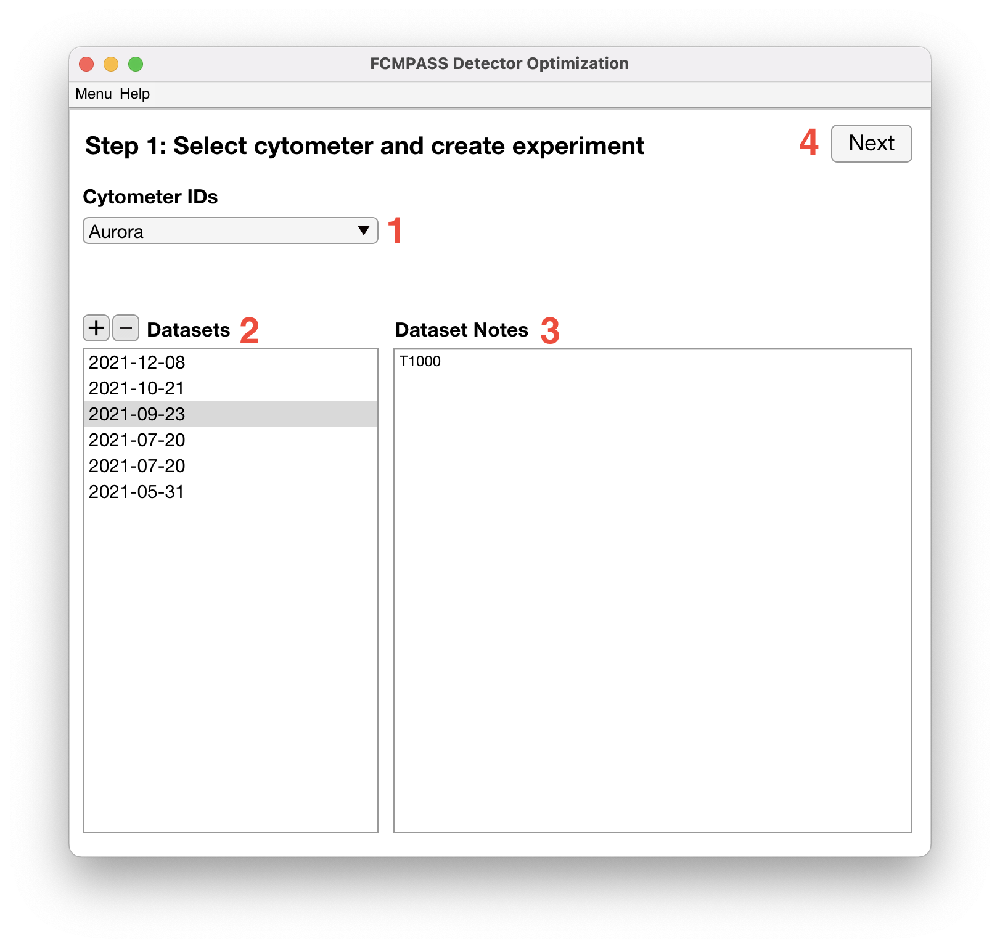
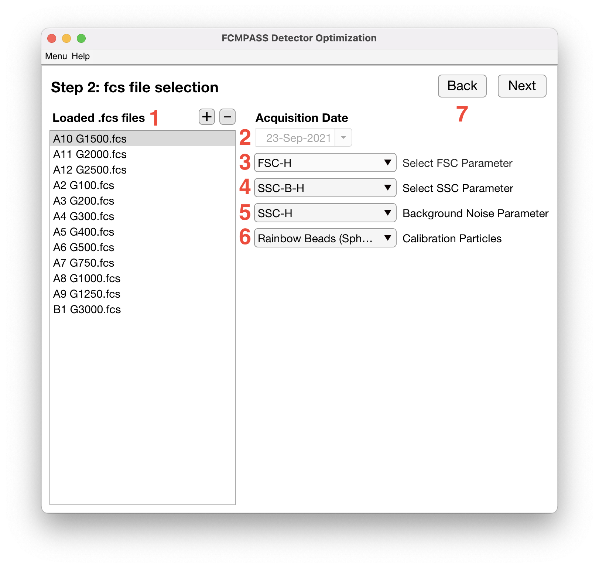
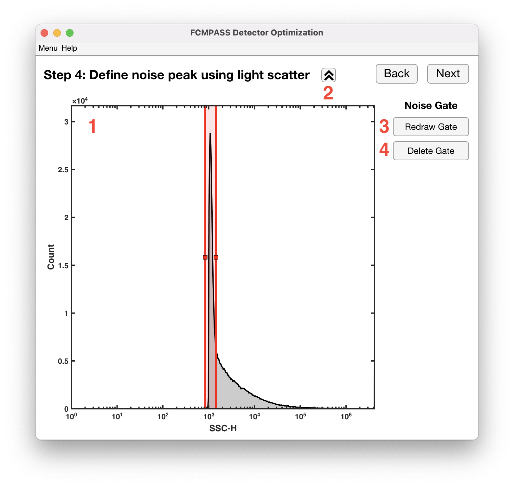
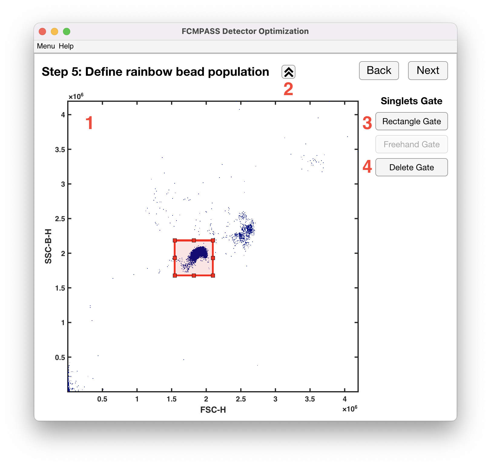
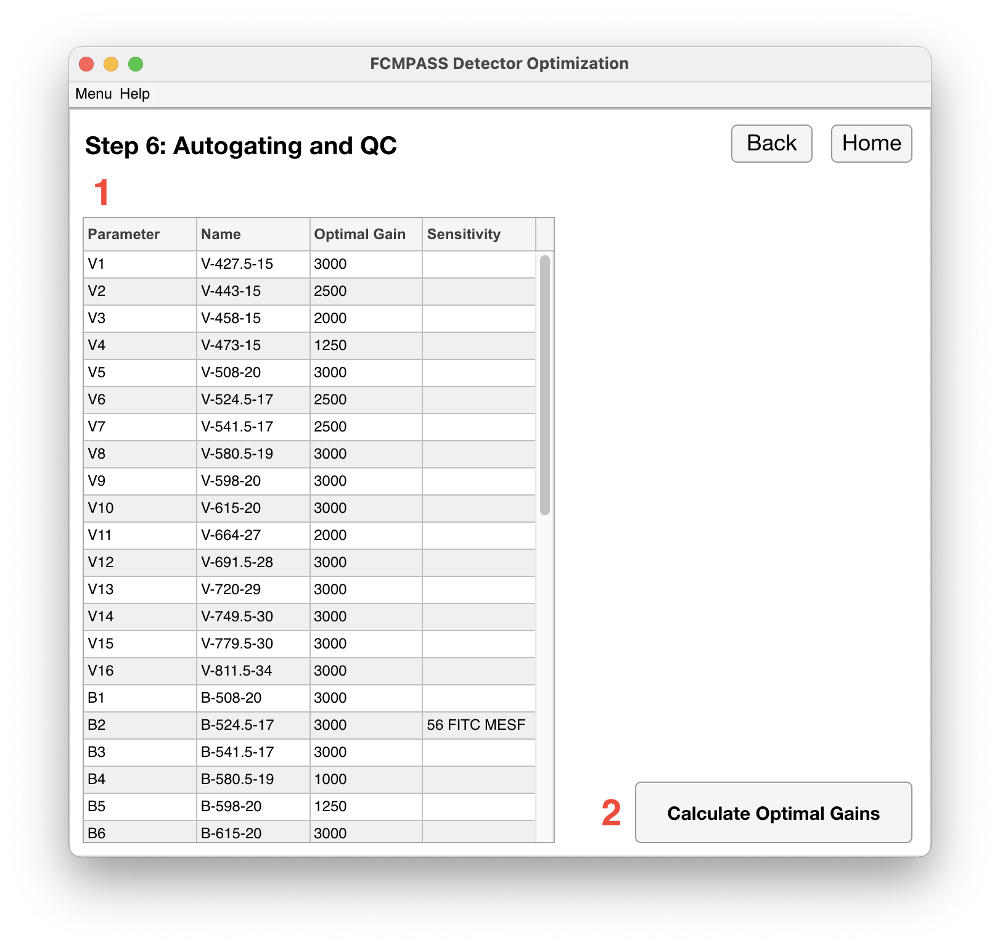

# Data analysis

## Step 1
<figure><figcaption></figcaption></figure>

1. “Cytometer ID” dropdown contains all the registered cytometers in the FCMPASS software. Cytometers are registered on the “Cytometers” tab in the catalogue. Selecting a cytometer will load all saved datasets into the ”Datasets” listbox (2) below.
2. “Datasets” listbox contains all saved datasets for the currently selected cytometer. The “add (+)” dataset button creates a new dataset listed as the current date. The software will immediately ask you to select the directory containing the voltration .fcs files. The date will be updated when .fcs files are loaded into the software. The “delete (-)” dataset button removes the currently selected dataset. Note: It is impossible to recover deleted datasets.
3. “Dataset Notes” listbox is where any desired information about the specific dataset can be stored. Any changes are automatically saved.
4. “Next” button moves the user to the next page in the detector optimization workflow.

## Step 2
<figure><figcaption></figcaption></figure>

1. “Loaded .fcs files” listbox lists the currently loaded .fcs files in the software. The “add (+)” .fcs files button will clear all .fcs files form the listbox and ask the user to select a directory containing the voltration .fcs files. The “delete (-)” .fcs files button clears only the selected .fcs files from the listbox.
2. “Acquisition Date” is automatically updated to the date listed in the first .fcs file loaded in the “Loaded .fcs files” listbox. This is the date that appears on the previous page in the “Datasets” listbox for saved datasets.
3. “Select FSC Parameter” dropdown lists the .fcs parameters found across all the loaded .fcs files, and the user will select the forward scatter parameter from the dropdown in order to gate the rainbow bead population. &#x20;
4. “Select SSC Parameter” dropdown lists the .fcs parameters found across all the loaded .fcs files, and the user will select the side scatter parameter from the dropdown in order to gate the rainbow bead population. “Background Noise Parameter” dropdown lists side scatter and fluorescent parameters found across all the loaded .fcs files. The user will select the parameter used to collect the noise events in the voltration experiment in order to gate the noise events.&#x20;
5. “Calibration Particles” dropdown lists all saved rainbow particles in the catalogue. The selected rainbow particles tells the software how many rainbow bead populations to look for when autogating.&#x20;
6. “Back” button moves the user to the previous page in the detector optimization workflow.&#x20;
7. “Next” button moves the user to the next page in the detector optimization workflow

## Step 3
<figure><figcaption></figcaption></figure>

1. “Parameters” column lists all the fluorescent parameters detected by the software in the loaded .fcs files. These parameters will be autogated and optimized by the software.
2. “Name” column lists the stain name for the corresponding fluorescent parameter.
3. “Fluorophore” column allows the user to select a cross calibration for the parameter. Selecting a cross calibration will calibrate the parameter into MESF units and allow for the determination of the limit of detection in MESF units for the parameter.
4. “Ref. Values” column will list the references values in MESF units assigned to the rainbow peaks if a cross calibration is selected.

## Step 4
<figure><figcaption></figcaption></figure>

1. “Noise Events” plot displays a histogram of the background noise parameter selected earlier in the workflow. The sharp peak will indicate the noise events while the gentle slope indicates the sheath events. The red noise gate should be positioned to gate the noise events with the right side of the gate excluding the sheath events.
2. “Plot Settings” button will open a dropdown allowing for the plot limits, scaling type, and resolution to be changed for the x-axis. The maximum plot range is what is listed as the parameter range in the .fcs file. The scaling options are linear and logarithmic. The resolution can be selected from a range of 128-512 inclusive. The resolution corresponds to the number of bins for the histogram.
3. “Redraw Gate” button will reset the red noise gate. Useful when changes have been made to the axis limits and need to recenter the gate. Also used to redraw the noise gate if it has been deleted.
4. “Delete Gate” button will delete the red noise gate from the plot. The user will not be able to advance in the detector optimization workflow until the red noise gate has been redrawn.

## Step 5
<figure><figcaption></figcaption></figure>

1. “Rainbow Bead Events” plot displays a 2D histogram of the SSC parameter vs. FSC parameter selected earlier in the workflow. The red gate should be positioned to gate the singlet rainbow bead population.
2. “Plot Settings” button will open a dropdown allowing for the plot limits, scaling type, and resolution to be changed for the x/y-axis. Similar to the previous plot, the scaling options are linear or logarithmic, and the resolution can be selected from a range of 128-512 inclusive.
3. “Rectangle Gate” button will delete the gate and the user will be prompted to draw a new gate. The user will not be able to advance until a new gate is drawn on the plot.
4. “Delete Gate” button will delete the gate from the plot. The user will not be able to advance in the detector optimization workflow until the red gate has been redrawn using the ”Rectangle Gate” button.

## Step 6
<figure><figcaption></figcaption></figure>

1. “Optimal Gains Table” has 4 columns with the first two columns displaying the fluorescent parameters, “Parameter” column, and their stain names, “Name” column. The third column labeled “Optimal Gain” displays the optimal gain for the corresponding fluorescent parameter. The fourth column labeled “Sensitivity” displays the limit of detection for the fluorescent parameters that were cross calibrated into MESF units.
2. “Calculate Optimal Gains” button will start algorithm for determining the optimal gains and sensitivities.
