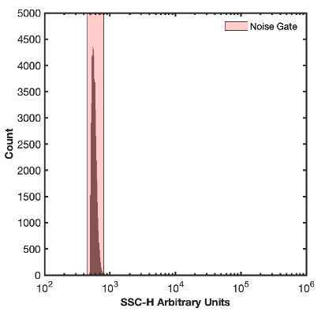
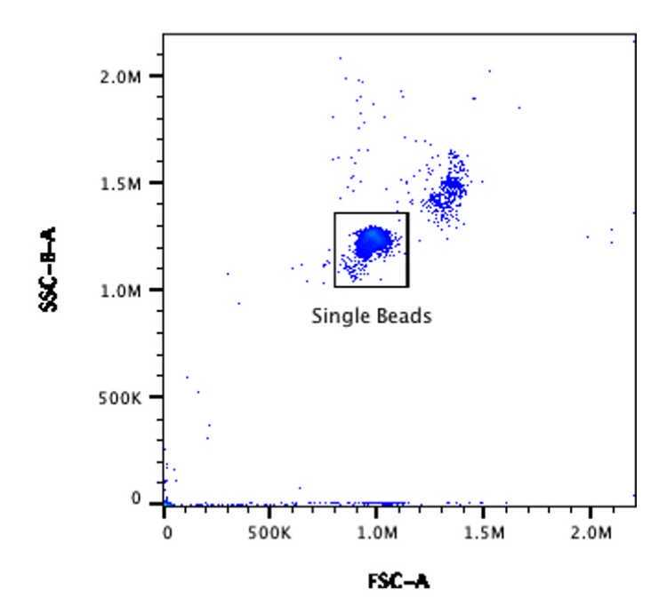

# Data generation

## Requirements

### Sample preparation

1. Vortex rainbow peak beads bottle on a medium setting for 5 seconds.&#x20;
2. Pipette 500 µL of DPBS in two FACS tubes. Label one tube ’DPBS” and the second tube ’Beads’.&#x20;
3. Add 3 drops of rainbow beads to the ’Beads’ tube and vortex for 5 seconds

### Cytometer setup

4. Ensure cytometer is clean and that -Height and -Area statistics are set to be collected on all parameters and that all parameters are on.&#x20;
!!! note
     On the Cytek Aurora, set window extension to 0. On the CytoFLEX platform turn on ’High Acquisition Mode’.&#x20;

5. Create a pseudocolor plot with FSC-H on the X-Axis and (488 nm) B-SSC-H on the Y-Axis and make sure both parameters are being plotted on a linear-scale.&#x20;
6. Create a histogram plot with (405 nm) V-SSC-H on the X-Axis and make sure it is plotted on a log-scale.&#x20;
7. Set the cytometer triggering threshold to (405 nm) VSSC-H. All samples should be acquired with the lowest flow rate, typically 10-15 µL min-1.&#x20;

!!! note
    Cytometer Voltage/Gain and threshold settings are subjective due to their dependency on alignment, and the scatter filters in place, amongst other variables. The following are guide values to start with and may need adjustment for optimal acquisition.

    Beckman Coulter, CytoFLEX  [405 nm OD0 filter, 488 nm OD2 filter]
    Threshold V-SSC-H = 1000; 
    V-SSC Gain = 200
    FSC Gain = 100
    B-SSC Gain = 100

    Cytek Bioscience, Aurora [405 nm OD0 filter, 488 nm OD2 filter]
    Threshold V-SSC-H = 1000; 
    V-SSC Gain = 600
    FSC Gain = 70
    B-SSC Gain = 70

8. Acquire the DPBS tube while viewing the histogram plot from step #6. Adjust the detector gain or trigger threshold until the instrument noise is being acquired at ~1000 events/sec. The instrument noise floor is distinct from detected background events in sheath as it has a sharp increase. In a system with debris there may be a tail that elongates out of this this sharp peak. 

<figure><figcaption></figcaption></figure>

    8.1 Recording this noise is not necessary as this step is identifying optimal settings.

9. Acquire the ’Beads’ tube from Step 3. Using the plot from Step 6 adjust the FSC and B-SSC gain until the single bead population is clearly visible and can be easily gated from the doublet population to the top right of it. Use the Violet SSC trigger settings identified in Step 10 .&#x20;

<figure><figcaption></figcaption></figure>

10. Creating a gate around the single bead population named ’Bead Gate’.&#x20;
11. Adjust the stopping criteria of the instrument to record until 10,000 events are acquired on ’Bead Gate’ drawn in Step 1.

## Detector setting incrementation (DSI)

12. DSI can now be performed by recording the ’Beads’ tube at multiple fluorescent detector gains, leaving the trigger threshold and light scatter gains consistent. It is recommended that a recording of at least 10 fluorescent detector settings is taken. Including more increments within a DSI set will result in being more confident of the subsequent optimal detector settings.&#x20;

    12.1 To ensure accurate data analysis, the brightest bead must be visible on at least two of the selected gains.

!!! note
    For flow cytometers with avalanche photodiodes its is recommended that the fluorescent detector settings have more incrementation at lower gains than higher gains while for instruments with photomultiplier tubes they should be spaced evenly. See template for example of settings for each tube analyses

    Example Gain Voltration for CytoFLEX & Aurora

    1. 100
    2. 200
    3. 300
    4. 400
    5. 500
    6. 750
    7. 1000
    8. 1250
    9. 1500
    10. 2000
    11. 2500
    12. 3000

13. Fluorescent channels can be cross calibrated to determine lower limit of detection for the channel in calibrated units in the FCMPASS software. A cross calibration between the desired MESF bead and rainbow beads should be acquired at a fluorescent detector gain where all MESF bead populations are on-scale and fully resolved from the noise.

