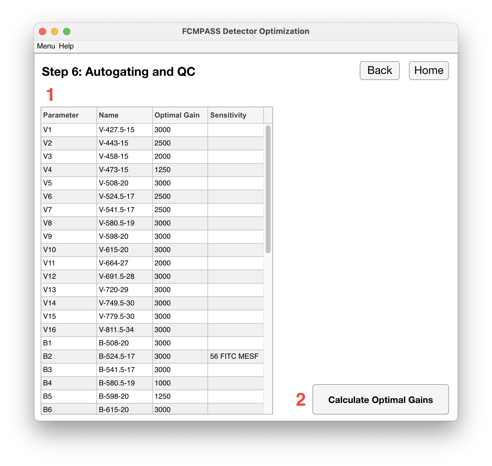

# Data outputs

Upon completion of detector incrementation analysis the optimal gains for small particle analysis will be shown. If the rainbow beads were cross-calibrated the sensitivity of the lower limit of detection will also be shown.

!!! note
    On the Cytek Aurora platform, an admin template settings file with the optimal gains will also be exported. This template will not normalize to QC data unless alterations are made and saved. Template is currently limited to the Aurora platform as other platforms encrypt their settings files.

<figure></figure>
