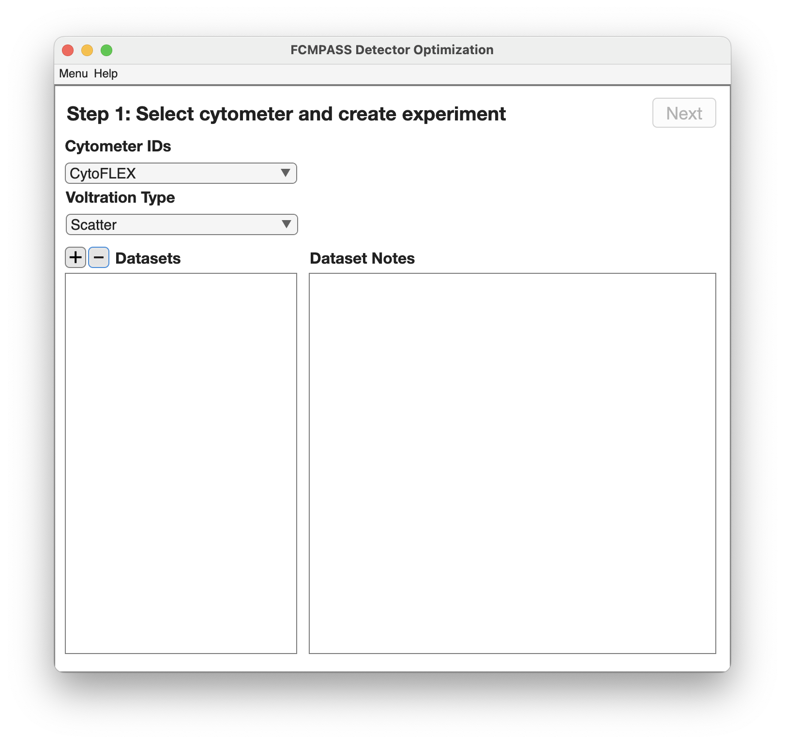
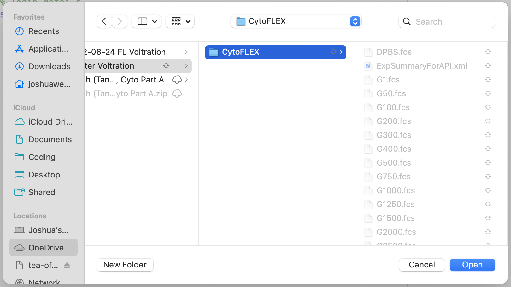
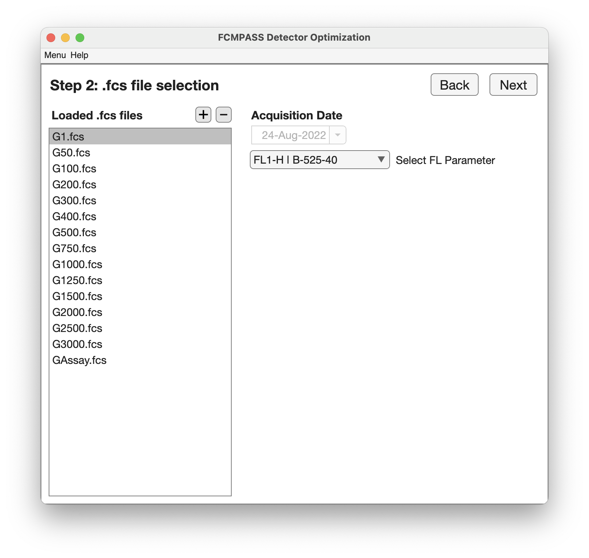
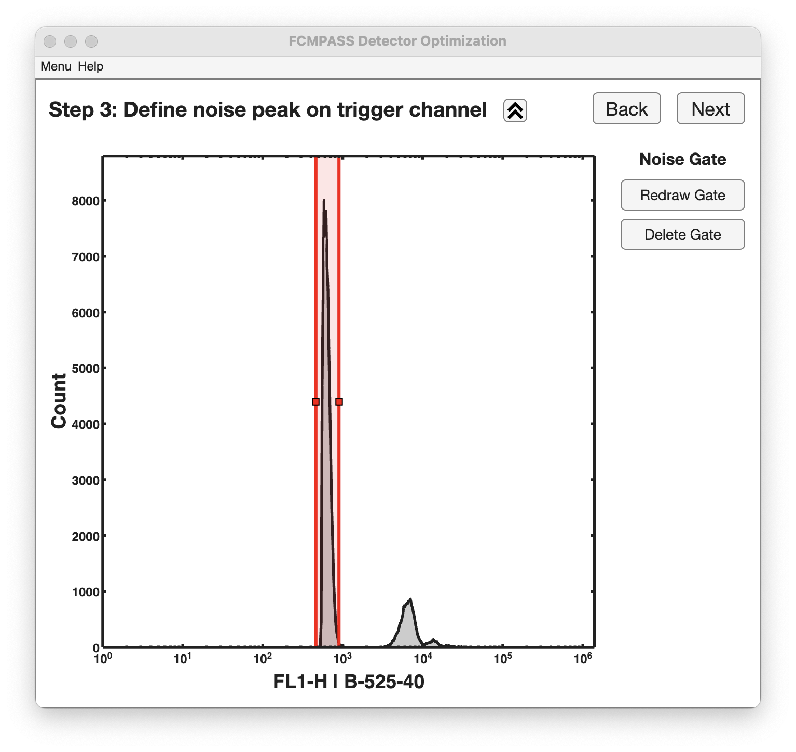
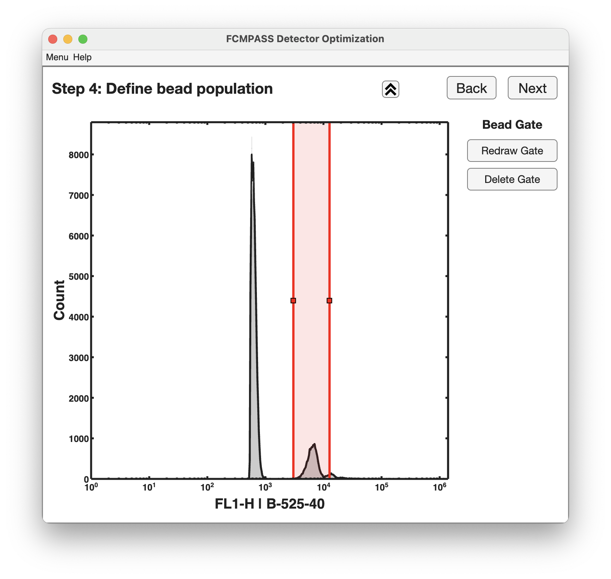
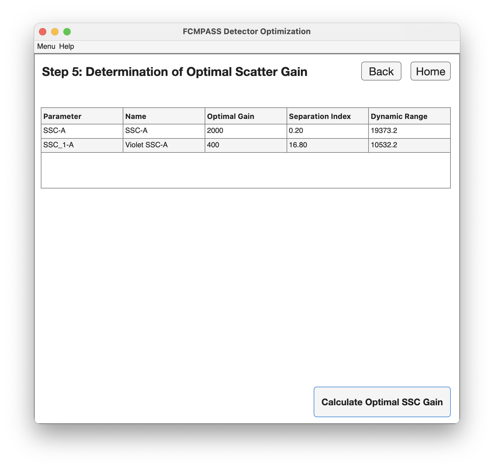

## Step 1
<figure><figcaption></figcaption></figure>

<figure><figcaption></figcaption></figure>

## Step 2

<figure><figcaption></figcaption></figure>

## Step 3

<figure><figcaption></figcaption></figure>

## Step 4

<figure><figcaption></figcaption></figure>

## Step 5

<figure><figcaption></figcaption></figure>
