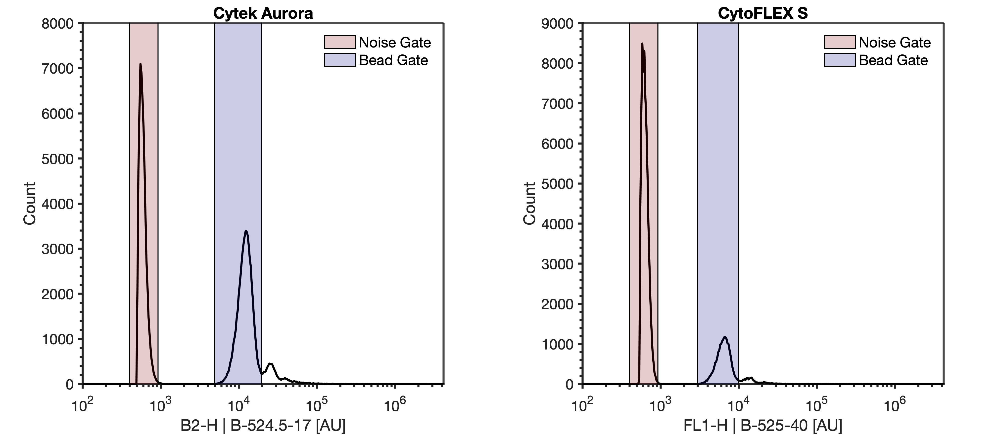

## Sample preparation

1. Vortex FluoSpheres bottle on a high setting for 5 secs. 

!!! note
    This stock bottle is 2% solids containing 110 nm beads, equal to ~2.73E13 / mL

!!! note
    This method in principle is compatible with any fluorescent nanosphere that is bright enough to be fully resolved when using a fluorescent trigger. 

2. Create 3 mL of 5E6 p/mL solution of FluoSpheres in a FACS tube.

    !!! note
        An observation from our protocol development is that using low protein binding tubes for this step may negatively impact the efficacy of this protocol as it can result in excess unbound fluorophore from the beads increasing background noise leading to excessive event rate.

    2.1 Pipette 2998.90 µL of DPBS into a FACS tube. Label this tube '1E10 Intermediate'. 

    2.2. Pipette 1.10 µL stock FluoSpheres into the tube labelled '1E10 Intermediate' . Reverse pipette the tube to mix.

    2.3 Pipette 990 µL of  DPBS into a FACS tube. Label this tube '1E8 Intermediate'. Pipette 10 µL "1E10 Intermediate" into the tube. Reverse pipette the tube to mix.

    2.4 Pipette 2850 µL of  DPBS into a FACS tube. Label this tube 'Beads. Pipette 150 µL "1E8 Intermediate" into the tube. Reverse pipette the tube to mix. This should result in a concentration of ~5E6 p/mL of FluoSpheres, and this tube will be used for acquisition.

3. Pipette 500 µL of DPBS into a FACS tube. Label this tube 'DPBS'.

## Cytometer Setup

4. Ensure cytometer is clean and that -Height and -Area statistics are set to be collected on all parameters and that all parameters are on.

5. On the Cytek Aurora, set window extension to 0. On the CytoFLEX platform turn on 'High Acquisition Mode'.

!!! note
    To set the window extension to 0 on the Cytek Aurora, navigate to the 'Lasers' tab under the sample acquisition settings and set the window extension to 0.

    To change the acquisition mode on the CytoFLEX S, click on the 'Advanced' menu on the top-of-the-screen ribbon. Next click on 'Event Rate Settings' menu, change the acquisition mode to 'High', and press 'Ok'.

6. Create a histogram plot with the FITC height parameter (CytoFLEX: FL1-H | B-525-40, Aurora: B2 | B-524.5-17) on the X-Axis and make sure it is plotted on a log-scale.

7. Create a histogram plot with (405 nm) violet SSC-A (CytoFLEX: SSC_1-A, Aurora: SSC-A) on the X-Axis and make sure it is plotted on a log-scale.

8. Set the cytometer triggering threshold to the FITC parameter (CytoFLEX: FL1 | B-525-40, Aurora: B2 | B-524.5-17) . **All samples should be acquired with the lowest flow rate, typically ~10-15 µL min-1.**

!!! note
    Cytometer Voltage/Gain and threshold settings are subjective due to their dependency on alignment, and the scatter filters in place, amongst other variables. The following are guide values to start with and may need adjustment for optimal acquisition.

    Beckman Coulter, CytoFLEX  [405 nm OD0 filter, 488 nm OD2 filter]
    Threshold FL1 | B-525-40-H = 550; 
    FL1 | B-525-40 Gain = 500

    Cytek Bioscience, Aurora [405 nm OD0 filter, 488 nm OD2 filter]
    Threshold B2 | B-524.5-17-H = 500; 
    B2 | B-524.5-17 Gain = 1750

9. Acquire the 'DPBS' tube while viewing the FITC histogram plot from step #6. Adjust the detector gain or trigger threshold until the instrument noise is being acquired at ~1000 events/sec. 

<figure></figure>

!!! note
    The instrument noise floor is distinct from detected background events in sheath as it has a sharp increase. In a system with debris there may be a tail that elongates out of this this sharp peak. 

    9.1 Recording this noise is not necessary as this step is identifying optimal settings.

10. Acquire the "Beads" tube from step #2. Using the plot from step #6, ensure the FluoSpheres are visible on the FITC and violet SSC parameter. Use the FITC trigger settings identified in step #9
  
<figure></figure>

!!! note
    The total event rate when acquiring the FluoSpheres should not exceed 6000 events/sec. If the event rate is higher than 6000 events/sec, further dilution of the FluoSpheres is necessary prior to acquisition.

11. Draw a gate around the FluoSpheres on the FITC parameter. Label this gate 'Bead Gate'

12. Adjust the stopping criteria of the instrument to record until at least 2,000 events are acquired on 'Bead Gate' drawn in step 11.

## Scatter Voltration

13. Voltration can now be performed by recording the 'Beads' tube at multiple light scatter detector gains, leaving the trigger threshold and fluorescent gains consistent. It is recommended that a recording of at least 10 light scatter detector settings is taken. Including more increments within a voltration will result in being more confident of the subsequent optimal detector settings.

    13.1 To ensure accurate data analysis, the FluoSpheres must separate from the noise population on the light scatter parameter on at least two of the selected gains. If they do not, repeat this protocol using a 200 nm FluoSphere population.

!!! note
    For flow cytometers with avalanche photodiodes its is recommended that the detector settings have more incrementation at lower gains than higher gains while for instruments with photomultiplier tubes they should be spaced evenly. See template for example of settings for each tube analyses

    Example Gain Voltration for CytoFLEX & Aurora

    1. 50
    2. 100
    3. 200
    4. 300
    5. 400
    6. 500
    7. 750
    8. 1000
    9. 1250
    10. 1500
    11. 2000
    12. 2500
    13. 3000

